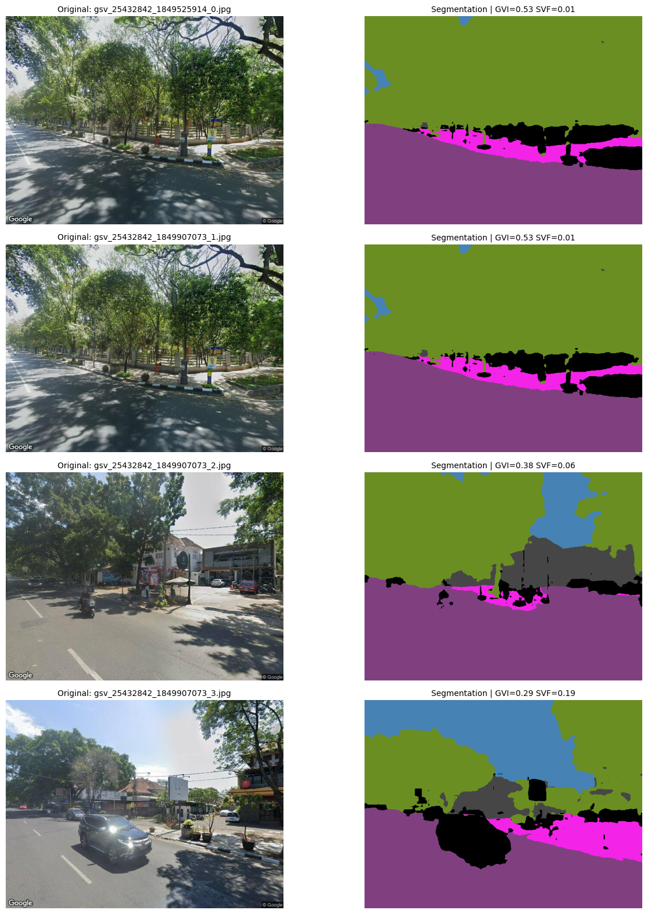
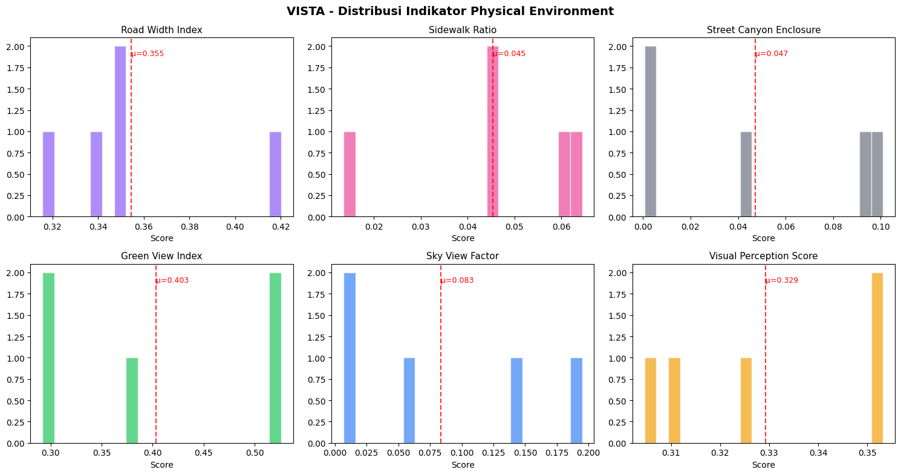

# 📘 Proyek VISTA — Dokumentasi Lengkap
## Urban Vitality Index untuk Kawasan Transit-Oriented Development (TOD)
**Kompetisi MAPID 2026 | Tim VISTA | Kota Bandung, Indonesia**

Dokumen ini adalah **dokumentasi teknis lengkap** dari seluruh alur kerja proyek VISTA.
Tujuannya agar **semua anggota tim** (baik yang berlatar Informatika maupun Perencanaan Wilayah dan Kota) dapat memahami apa yang sudah dibangun, bagaimana cara kerjanya, dan apa langkah selanjutnya.


---

## 📍 Daftar Isi
1. [Peta Jalan (Roadmap) & Status](#-peta-jalan-roadmap--status-saat-ini)
2. [Catatan Penting: Hosting & Integrasi API](#-catatan-penting-hosting--integrasi-api-mapid)
3. [Arsitektur Sistem & Daftar File](#-arsitektur-sistem--daftar-file)
4. [Tahap 1: Akuisisi Data Jaringan Jalan & Halte](#-tahap-1-akuisisi-data-jaringan-jalan--halte)
5. [Tahap 1B: Pembentukan TAS-Nits](#-tahap-1b-pembentukan-tas-nits-transit-access-segment-units)
6. [Tahap 2: AI Computer Vision (Google Street View)](#-tahap-2-ai-computer-vision-google-street-view)
7. [Tahap 3: Aksesibilitas Fasilitas Publik](#-tahap-3-aksesibilitas-fasilitas-publik)
8. [Tahap 4: Sentimen Warga (NLP)](#-tahap-4-sentimen-warga-nlp)
9. [Tahap 5: Kalkulasi UVI](#-tahap-5-kalkulasi-urban-vitality-index-uvi)
10. [Tahap 6: WebGIS Dashboard](#-tahap-6-webgis-dashboard)
11. [Penjelasan Algoritma Inti](#-penjelasan-algoritma-inti)
12. [Cara Menjalankan Pipeline](#-cara-menjalankan-pipeline)
13. [Manajemen Biaya API Key](#-manajemen-biaya-google-maps-api-key)

---

## 📍 Peta Jalan (Roadmap) & Status Saat Ini
Sesuai dengan **6 Tahapan Implementasi** di Proposal VISTA (Halaman 10, Bagian 4.1).

| Tahap | Deskripsi | Status | Keterangan |
| :--- | :--- | :---: | :--- |
| **Tahap 1** | Akuisisi Data Jaringan Jalan & Halte | ✅ **Selesai** | 844 halte + 17.193 titik jalan diekstrak dari OpenStreetMap |
| **Tahap 1B** | Pembentukan TAS-Nits (5.876 Unit) | ✅ **Selesai** | 5.876 unit spasial (`TASnit 0001` - `TASnit 5876`) terbentuk via Stop-Point Line Split |
| **Tahap 2** | AI Computer Vision (Visual Fisik) | ✅ **Selesai** | 17.193 gambar diproses di Colab (SegFormer) menghasilkan GVI, SVF, Trotoar, dsb |
| **Tahap 3** | Aktivitas & Fungsi Perkotaan (POI Access) | ✅ **Selesai** | 3.602 POI diekstrak, evaluasi keragaman fasilitas & buffer 400m per TAS-Nit |
| **Tahap 4** | Sentimen Warga (NLP & Transparansi) | 🔄 **Berjalan (Hybrid)** | 9.787 ulasan Google Places + metrik transparansi sampel (Tinggi/Cukup/Terbatas) |
| **Tahap 5** | Kalkulasi Urban Vitality Index (UVI) | 🔄 **Berjalan (Fase 1 Selesai)** | Formula UVI Komposit (Equal Weighting + Integrasi MAPID Missions & Activities) |
| **Tahap 6** | WebGIS Dashboard & Spatial Search | ✅ **Selesai (Production Ready)** | Peta Deck.gl WebGL, Vercel ISR, Pencarian ID TASnit, Cincin Sorot Target, & 3 Mode Geometri |

---

## 🚀 Catatan Penting: Hosting & Integrasi API MAPID

### 1. Kebutuhan Hosting & Kinerja Vercel ISR
**Sama sekali tidak berat!** Meskipun dataset spasialnya sangat masif (ribuan titik TAS-Nits, halte, dan POI), aplikasi ini dirancang khusus dengan arsitektur modern yang menjamin kinerja super cepat:
- **Client-Side Rendering via WebGL (Deck.gl v9)**: Merender jutaan titik langsung di **GPU komputer/HP pengguna (Client-side)**, bukan di server.
- **Incremental Static Regeneration (ISR)**: Di-deploy di **Vercel** dengan konfigurasi `export const revalidate = 3600;` pada backend API route (`/api/tas-nits`). Hal ini membuat dashboard disajikan instan ($<100\text{ms}$) dari Vercel Global Edge CDN, sambil otomatis memperbarui rekalkulasi UVI di latar belakang setiap 1 jam jika ada data lapangan baru.
- **Biaya Hosting**: **100% Gratis** memanfaatkan infrastruktur serverless Vercel Edge.

### 2. Status Integrasi API & Crowdsourced Ekosistem MAPID
Sistem backend VISTA (`/app/api/tas-nits/route.ts`) telah siap dan dioptimalkan untuk mengonsumsi data ekosistem MAPID secara *plug-and-play*:
- **Sentimen Warga (NLP)**: Menggabungkan data review Google Places dengan data postingan **MAPID Activities** menggunakan sistem pembobotan setara (50% Tim VISTA : 50% Ekosistem MAPID).
- **Misi MAPID (Menu GO & Struk GO)**: Mengintegrasikan intensitas transaksi kuliner dan ekonomi mikro sebagai penguat pilar *Aktivitas & Fungsi Perkotaan*. Variabel *Properti GO* ditiadakan berdasarkan keputusan relevansi fokus TOD.
- **Basemap Vector Tiles**: Menggunakan styling resmi **MAPID Vector Basemap v2** dengan sistem fallback otomatis ke Carto Dark Matter jika API Key tidak ditemukan.

---

## 🏗️ Arsitektur Sistem & Daftar File

### Struktur Folder
```
ai_pipeline/
├── 1_extract_street_network.py    ← Tahap 1: Ekstrak jalan & halte dari OSM
├── 1b_build_tas_nits.py           ← Tahap 1B: Pembentukan TAS-Nits (KD-Tree)
├── 2_scrape_gsv.py                ← Tahap 2: Download gambar Google Street View
├── 2b_run_segmentation_local.py   ← Tahap 2B: Jalankan AI SegFormer di lokal
├── 3_accessibility_analysis.py    ← Tahap 3: Hitung skor aksesibilitas
├── 3_semantic_segmentation_colab.ipynb ← Tahap 2 (Colab): AI SegFormer di cloud
├── 4_scrape_reviews.py            ← Tahap 4: Scraping ulasan Google Places & NLP
├── 5_calculate_uvi.py             ← Tahap 5: Kalkulasi UVI komposit
└── data/
    ├── bus_stops.csv                   ← 844 halte/bus stop se-Bandung
    ├── sample_points_gsv.csv           ← 17.193 titik jalan (setiap 50m)
    ├── sample_points_with_tas_nits.csv ← Titik jalan + assignment ke TAS-Nit
    ├── tas_nits_summary.csv            ← 5.876 ringkasan statistik TAS-Nit
    ├── pois_bandung.csv                ← 3.602 fasilitas publik (POI)
    ├── accessibility_score.csv         ← Skor aksesibilitas per TAS-Nit
    ├── physical_environment_score.csv  ← Skor lingkungan fisik (17.193 titik)
    ├── physical_environment_tasnit.csv ← Skor lingkungan fisik per TAS-Nit
    ├── google_places_bandung.csv       ← 1.969 tempat di sekitar halte
    ├── google_reviews_raw.csv          ← 9.787 teks ulasan mentah
    ├── sentiment_score.csv             ← Skor sentimen warga per TAS-Nit
    ├── proposal_text.txt               ← Teks proposal yang sudah diekstrak
    └── images/                         ← Folder gambar Google Street View

vista-dashboard/
├── app/
│   ├── api/
│   │   ├── tas-nits/route.ts      ← Multi-pillar merge API (5.876 TAS-Nits)
│   │   ├── bus-stops/route.ts     ← API data halte bus (844 halte)
│   │   ├── pois/route.ts          ← API fasilitas publik (3.602 POI)
│   │   └── mapid-tiles/           ← Proxy Vector Tiles MAPID
│   ├── page.tsx                   ← Main Dashboard (Layout 4 Zona, CCIA Storytelling)
│   └── globals.css                ← Liquid Glass Design System
├── components/
│   ├── Map.tsx                    ← Deck.gl + MapLibre + Sequential Gradient + Legend
│   ├── StatsPanel.tsx             ← Dynamic Histogram, 3 Pilar Cards, Linked View Detail
│   └── Sidebar.tsx                ← Liquid Glass Floating Navigation
└── public/data/                   ← Client-side spatial data cache (CSV)
```

### Alur Data (Data Flow)
```
OpenStreetMap ──→ [Tahap 1] ──→ bus_stops.csv + sample_points_gsv.csv
                                        │
                                        ▼
                               [Tahap 1B: KD-Tree] ──→ tas_nits_summary.csv
                                        │
                          ┌─────────────┼─────────────┐
                          ▼             ▼             ▼
                    [Tahap 2]     [Tahap 3]     [Tahap 4]
                   GSV Images    Accessibility   NLP Sentiment
                       │             │               │
                       ▼             ▼               ▼
                  [SegFormer]   accessibility_   sentiment_
                       │        score.csv        score.csv
                       ▼
              physical_environment_score.csv
                          │             │               │
                          └─────────────┼─────────────┘
                                        ▼
                              [Tahap 5: UVI Calculation]
                                        │
                                        ▼
                              [Tahap 6: WebGIS Dashboard]
```

---

## 🔬 Tahap 1: Akuisisi Data Jaringan Jalan & Halte

### Tujuan
Mengekstrak seluruh **jaringan jalan utama** (koridor transportasi massal) dan **titik halte/bus stop** di Kota Bandung secara otomatis.

### Sumber Data
**OpenStreetMap (OSM)** — database peta kolaboratif terbesar di dunia. Data diakses secara programatik melalui library Python bernama **OSMnx** (dibuat oleh Geoff Boeing, professor Urban Planning di USC).

### Apa yang Diekstrak?

#### A. Halte Bus / Simpul Transportasi (844 titik)
Script mengunduh semua POI di Bandung yang memiliki tag OpenStreetMap:
- `highway = bus_stop` (halte bus konvensional)
- `public_transport = platform` (platform angkutan umum)

Ini mencakup halte Trans Metro Bandung (TMB), shelter BRT, dan titik pemberhentian angkot resmi.

**File output**: `data/bus_stops.csv`
| Kolom | Penjelasan |
|---|---|
| `name` | Nama halte (contoh: "Gasibu", "Alun-alun Bandung") |
| `lat` | Latitude (garis lintang) |
| `lon` | Longitude (garis bujur) |

#### B. Jaringan Jalan Koridor Utama (17.193 titik)
Script mengunduh graf jaringan jalan dari OSM dengan **filter ketat**. Hanya jalan berikut yang diambil:

| Kode OSM | Tipe Jalan | Contoh di Bandung |
|---|---|---|
| `primary` | Jalan utama / arteri | Jl. Soekarno-Hatta, Jl. Asia Afrika |
| `secondary` | Jalan sekunder / kolektor | Jl. Dipatiukur, Jl. Cihampelas |
| `tertiary` | Jalan tersier / penghubung | Jl. Cihapit, Jl. Sulanjana |
| `trunk` | Jalan batang / nasional | Jl. Ir. H. Djuanda (Dago) |

> **Penting**: Jalan tipe `residential` (gang perumahan), `service`, dan `footway` **TIDAK diambil** karena di situ bukan rute transportasi massal. Ini sesuai fokus proposal VISTA pada kawasan TOD.

Setelah graf jalan diunduh, sistem melakukan **interpolasi titik setiap 50 meter** di sepanjang setiap ruas jalan. Caranya:
1. Seluruh geometri jalan diproyeksikan ke sistem koordinat UTM (agar satuan dalam meter, bukan derajat).
2. Untuk setiap ruas jalan, sistem membuat titik baru setiap 50 meter menggunakan fungsi `geometry.interpolate(distance)`.
3. Titik-titik tersebut dikonversi kembali ke koordinat WGS84 (Latitude, Longitude).

**File output**: `data/sample_points_gsv.csv`
| Kolom | Penjelasan |
|---|---|
| `edge_id` | ID ruas jalan (format: `nodeA_nodeB`) |
| `name` | Nama jalan (contoh: "Jalan Soekarno-Hatta") |
| `highway` | Tipe jalan (primary/secondary/tertiary/trunk) |
| `lat` | Latitude titik sampel |
| `lon` | Longitude titik sampel |

### Script
**File**: `ai_pipeline/1_extract_street_network.py`
**Cara menjalankan**:
```bash
cd ai_pipeline
python 1_extract_street_network.py
```

---

## 🔬 Tahap 1B: Pembentukan TAS-Nits (Transit-Access Segment Units)

### Apa itu TAS-Nits?
Sesuai Proposal VISTA (Halaman 4):
> *"Transit-Access Segment Units (TAS-Nits) merupakan unit analisis spasial yang dibentuk dengan membagi jaringan jalan berdasarkan lokasi halte transportasi publik dan simpang jalan."*

Dalam tata kota, kita tidak bisa menganalisis jalan per 50 meter karena terlalu granular dan tidak bermakna secara perencanaan. TAS-Nit adalah **"Zona Layanan Halte"** — yaitu kumpulan titik-titik jalan yang paling dekat dengan halte yang sama.

### Cara Kerja Algoritma (Stop-Point Line Split Analysis)

#### Langkah 1: Siapkan Data
- Muat 844 halte dari `bus_stops.csv`
- Muat 17.193 titik jalan dari `sample_points_gsv.csv`
- Bersihkan data (buang halte tanpa koordinat valid)

#### Langkah 2: Bangun Spatial KD-Tree dari Halte
Sistem membangun struktur data **KD-Tree** (K-Dimensional Tree) dari koordinat 844 halte. KD-Tree adalah struktur data pohon biner yang mempartisi ruang multidimensi sehingga pencarian *Nearest Neighbor* (tetangga terdekat) bisa dilakukan dalam waktu **O(log n)** — sangat cepat! (Lihat bagian [Penjelasan Algoritma](#-penjelasan-algoritma-inti) untuk detail teknis KD-Tree.)

```python
from scipy.spatial import cKDTree

bus_coords = np.column_stack([bus_stops['lat'], bus_stops['lon']])
tree = cKDTree(bus_coords)  # Bangun tree dari 844 halte
```

#### Langkah 3: Query Nearest Neighbor
Untuk **setiap** dari 17.193 titik jalan, sistem bertanya ke KD-Tree: *"Halte mana yang paling dekat dengan titik ini?"*

```python
sample_coords = np.column_stack([sample_points['lat'], sample_points['lon']])
distances, indices = tree.query(sample_coords)
# distances = jarak ke halte terdekat (dalam derajat)
# indices = indeks halte terdekat (0-843)
```

Operasi ini memproses 17.193 titik dalam **kurang dari 1 detik** berkat efisiensi KD-Tree. Jika menggunakan metode *brute force* (bandingkan setiap titik ke semua 844 halte), dibutuhkan 17.193 × 844 = **14,5 juta** operasi perbandingan.

#### Langkah 4: Konversi Jarak
Jarak hasil query KD-Tree awalnya dalam **satuan derajat** (karena inputnya Lat/Lon). Kita konversi ke meter:
```python
distances_meters = distances * 111320  
# 1 derajat latitude ≈ 111.320 meter (di sekitar ekuator/Indonesia)
```

#### Langkah 5: Clustering — Bentuk TAS-Nit
Setiap titik jalan di-*assign* ke halte terdekatnya. ID TAS-Nit dibuat dari gabungan ID ruas jalan + ID halte:
```
TAS-Nit ID = edge_id + "_STOP" + stop_id
Contoh: 10101152065_1849525943_STOP41 
        (Ruas jalan 10101152065→1849525943, halte terdekat #41 = "Riau Cihapit")
```

Titik-titik yang memiliki TAS-Nit ID yang **sama** disatukan menjadi 1 segmen. Itulah mengapa 17.193 titik **mengerucut** menjadi **5.876 TAS-Nits**.

#### Langkah 6: Klasifikasi Walking Distance
Setiap TAS-Nit diklasifikasikan berdasarkan jarak rata-ratanya ke halte (standar internasional TOD):

| Kelas | Jarak | Estimasi Jalan Kaki | Jumlah TAS-Nit | Persentase |
|---|---|---|---|---|
| Sangat Dekat | < 200m | ~2 menit | **4.319** | **73.5%** |
| Dekat | 200 - 400m | 3-5 menit | 1.108 | 18.9% |
| Sedang | 400 - 800m | 5-10 menit | 405 | 6.9% |
| Jauh | > 800m | > 10 menit | 44 | 0.7% |

> **Temuan Riset**: 73.5% jalan utama di Bandung berjarak < 200 meter dari halte. Artinya, secara spasial, infrastruktur Bandung **sudah sangat ideal** untuk TOD. Tapi pertanyaannya: *kenapa warga masih enggan naik angkutan umum?* Nah, itulah yang dijawab VISTA melalui pilar Physical Environment dan Sentimen!

### File Output
- `data/sample_points_with_tas_nits.csv` — 17.193 titik + kolom assignment TAS-Nit
- `data/tas_nits_summary.csv` — 5.876 baris ringkasan statistik per TAS-Nit

| Kolom Penting di `tas_nits_summary.csv` | Penjelasan |
|---|---|
| `tas_nit_id` | ID unik segmen |
| `n_points` | Jumlah titik jalan dalam segmen ini |
| `avg_distance_to_stop` | Rata-rata jarak ke halte (meter) |
| `nearest_stop_name` | Nama halte terdekat |
| `street_name` | Nama jalan |
| `walking_class` | Klasifikasi jarak jalan kaki |

### Script
**File**: `ai_pipeline/1b_build_tas_nits.py`
```bash
python 1b_build_tas_nits.py
```

---

## 🔬 Tahap 2: AI Computer Vision (Google Street View)

### Tujuan
Mengubah **persepsi visual jalanan** yang subjektif menjadi **angka matematis** yang objektif dan terukur, sesuai Proposal Tabel 3 No. 9 dan Tabel 4.

### Sub-Tahap 2A: Download Gambar Google Street View

#### Bagaimana Cara Kerja Google Street View Static API?
Google menyediakan API resmi untuk mendownload foto panoramik jalanan dari server mereka. Kita mengirim *HTTP request* ke endpoint:
```
https://maps.googleapis.com/maps/api/streetview
  ?size=640x480              ← Resolusi gambar
  &location=-6.91105,107.627 ← Koordinat (lat, lon)
  &fov=90                    ← Field of View (sudut pandang)
  &heading=0                 ← Arah kamera (0°=Utara, 90°=Timur, ...)
  &pitch=0                   ← Kemiringan kamera (0°=horizontal)
  &key=API_KEY               ← Kunci autentikasi
```

Google akan merespons dengan **file JPEG** berisi foto jalanan pada koordinat tersebut.

#### API Key
- **Apa itu API Key?** Kunci autentikasi unik yang dikeluarkan oleh Google Cloud Platform untuk mengidentifikasi proyek kita dan menagih biaya penggunaan.
- **Cara mendapatkan**: Buat project di [Google Cloud Console](https://console.cloud.google.com/) → aktifkan "Street View Static API" → buat API Key di bagian Credentials.
- **API Key proyek kita**: `YOUR_API_KEY_HERE` (Ganti dengan API Key Anda)

#### Validasi Gambar
Tidak semua koordinat memiliki foto Street View (misal: jalan pelosok, jalan baru). Sistem melakukan pengecekan:
```python
if len(response.content) > 5000:  # Gambar asli biasanya > 5KB
    # Simpan gambar → ini gambar valid
else:
    # Skip → Google mengirim placeholder "No Image Available"
```

#### Fitur Tambahan
- **Mode 4 Arah**: Dengan flag `--four-directions`, sistem mendownload 4 gambar per titik (heading 0°, 90°, 180°, 270°) untuk mendapatkan pandangan 360°.
- **Resume Download**: Jika proses terputus, sistem otomatis melewatkan gambar yang sudah berhasil didownload sebelumnya.
- **Rate Limiting**: Jeda 0.1 detik antar request agar tidak melebihi batas Google (1.000 request/menit).

#### Script
**File**: `ai_pipeline/2_scrape_gsv.py`
```bash
# Download 5 gambar (test billing)
python 2_scrape_gsv.py --api-key YOUR_API_KEY_HERE --max-images 5

# Download 50 gambar
python 2_scrape_gsv.py --api-key YOUR_API_KEY_HERE --max-images 50

# Download 50 gambar, 4 arah per titik (total 200 gambar)
python 2_scrape_gsv.py --api-key YOUR_API_KEY_HERE --max-images 50 --four-directions
```

**File output**: Gambar disimpan di `data/images/` dengan format nama:
```
gsv_{edgeID}_{index}.jpg
Contoh: gsv_25432842_1849907073_1.jpg
```

---

### Sub-Tahap 2B: AI Semantic Segmentation (SegFormer)

#### Apa itu Semantic Segmentation?
Semantic Segmentation adalah teknik Computer Vision yang mengklasifikasikan **setiap piksel** dalam sebuah gambar ke dalam kategori tertentu. Berbeda dengan Object Detection (yang hanya mendeteksi bounding box objek), Semantic Segmentation memberikan label ke **seluruh** area gambar.

#### Model yang Digunakan: SegFormer-b2
- **Nama lengkap**: `nvidia/segformer-b2-finetuned-cityscapes-1024-1024`
- **Dibuat oleh**: NVIDIA Research
- **Arsitektur**: Berbasis **Transformer** (teknologi yang sama dengan GPT/ChatGPT, tapi untuk gambar). SegFormer menggunakan *Mix Transformer (MiT)* encoder.
- **Dataset training**: **Cityscapes** — dataset benchmark perkotaan dari kota-kota di Eropa yang berisi 30 kelas objek urban (jalan, trotoar, pohon, mobil, pejalan kaki, bangunan, dll).
- **Kenapa SegFormer, bukan U-Net/YOLO?** SegFormer lebih modern (2021) dan memberikan akurasi lebih tinggi pada scene perkotaan dengan kompleksitas arsitektur yang lebih rendah (tidak perlu decoder yang berat).

#### 5 Indikator VISTA yang Diekstrak

| No | Indikator | Cityscapes Class ID | Warna di Peta Segmentasi | Penjelasan |
|---|---|---|---|---|
| 1 | **Road Width Index** | 0 (road) | Ungu gelap | Proporsi lebar jalan aspal terhadap total gambar. Semakin lebar → semakin besar indeks. |
| 2 | **Sidewalk Ratio** | 1 (sidewalk) | Pink/Magenta | Proporsi trotoar. Indikator paling penting untuk *walkability* menuju halte. |
| 3 | **Street Canyon Enclosure** | 2 (building) | Abu-abu/Hitam | Proporsi bangunan yang mengurung jalan. Skor tinggi = jalan terasa sempit dan tertutup. |
| 4 | **Green View Index (GVI)** | 8 (vegetation) | Hijau | Proporsi vegetasi/pohon. Literatur membuktikan GVI tinggi meningkatkan keinginan warga untuk berjalan kaki. |
| 5 | **Sky View Factor (SVF)** | 10 (sky) | Biru muda | Proporsi langit yang terlihat. Berkorelasi terbalik dengan GVI (semakin rimbun pohon, semakin sedikit langit terlihat). |

#### Rumus Visual Perception Score
Kelima indikator digabungkan dengan pembobotan:
```
Visual Perception Score = 
    GVI × 0.30          (Penghijauan — bobot terbesar karena paling berpengaruh)
  + SVF × 0.25          (Keterbukaan langit)
  + Sidewalk × 0.20     (Ketersediaan trotoar)
  + (1 - Enclosure) × 0.15  (Semakin rendah enclosure = semakin baik)
  + Road Width × 0.10   (Lebar jalan)
```

#### Hasil Eksekusi Massal (17.193 Gambar)
Seluruh 17.193 gambar Google Street View dari sepanjang koridor TOD Bandung telah berhasil diproses menggunakan Google Colab (GPU). Hasil segmentasi piksel per piksel kemudian dikonversi menjadi skor lingkungan fisik (*Physical Environment Score*) dan diagregasi (dirata-rata) ke tingkat TAS-Nit.

#### Contoh Hasil Segmentasi (Jl. L.L. RE. Martadinata / Jl. Riau)

| Gambar | Road Width | Sidewalk | Enclosure | GVI | SVF | **Score** |
|---|---|---|---|---|---|---|
| gsv_..._0.jpg | 0.3492 | 0.0447 | 0.0006 | **0.5255** | 0.0067 | **0.3531** |
| gsv_..._1.jpg | 0.3493 | 0.0447 | 0.0010 | **0.5260** | 0.0068 | **0.3532** |
| gsv_..._2.jpg | 0.4201 | 0.0135 | 0.0919 | 0.3800 | 0.0631 | 0.3107 |
| gsv_..._3.jpg | 0.3156 | 0.0644 | 0.0412 | 0.2932 | **0.1949** | **0.3249** |
| gsv_..._4.jpg | 0.3388 | 0.0595 | 0.1010 | 0.2919 | 0.1454 | 0.3046 |

> **Insight**: Gambar 0 dan 1 (posisi di bawah pohon rindang Jl. Riau) memiliki GVI sangat tinggi (52%) dan SVF sangat rendah (0.6%), menunjukkan AI berhasil menangkap kanopi pohon yang menutupi langit. Gambar 3 (posisi lebih terbuka) memiliki SVF tertinggi (19%) karena langit mulai terlihat.

##### Visualisasi Hasil Segmentasi & Distribusi Skor




#### Cara Menjalankan
**Opsi A — Di Google Colab (Rekomendasi untuk pemrosesan massal)**:
1. Upload folder `ai_pipeline` ke Google Drive
2. Buka `3_semantic_segmentation_colab.ipynb` di Colab
3. Klik Runtime → Run all

**Opsi B — Di Komputer Lokal (untuk testing kecil, perlu install PyTorch)**:
```bash
python 2b_run_segmentation_local.py
```

**File output**: 
- `data/physical_environment_score.csv` (Skor per titik jalan / gambar, 17.193 baris)
- `data/physical_environment_tasnit.csv` (Skor diagregasi per TAS-Nit yang siap digabung ke UVI)

---

## 🔬 Tahap 3: Aktivitas & Fungsi Perkotaan (Urban Activity & Function)

### Tujuan & Penyempurnaan Nomenklatur
Sesuai Proposal (Tabel 4) dan kaidah keilmuan *Urban Planning*, pilar ini dinamai **"Aktivitas & Fungsi Perkotaan"** (sebelumnya Aksesibilitas) untuk merepresentasikan keragaman, ketersediaan, dan kesesuaian fasilitas publik (**pendidikan, kesehatan, olahraga, komersial, finansial, dan katering**) dalam radius jalan kaki 400 meter dari simpul transit angkutan umum.

### Sumber Data Fasilitas (POI)
Data diambil secara otomatis dari **OpenStreetMap** menggunakan library **OSMnx**. Query yang digunakan:

| Kategori | Tag OSM yang Dicari | Jumlah Ditemukan |
|---|---|---|
| 🍽️ Katering | `amenity = restaurant, cafe, fast_food, food_court` | **1.397** |
| 🛍️ Komersial | `shop = *` (semua toko) | **1.319** |
| 🏦 Finansial | `amenity = bank, atm` | **585** |
| 🏫 Pendidikan | `amenity = school, university, college, kindergarten` | **144** |
| 🏥 Kesehatan | `amenity = hospital, clinic, doctors, pharmacy` | **130** |
| ⚽ Olahraga | `leisure = sports_centre, stadium, swimming_pool, fitness_centre` | **27** |
| | **Total POI** | **3.602** |

### Cara Kerja (2 Komponen Skor)

#### Komponen A: Transit Accessibility (Jarak ke Halte)
Mengukur seberapa dekat segmen jalan ke halte terdekat.
```
Transit Accessibility = 1 - (jarak_rata_rata_ke_halte / 800)
```
- Jarak 0 meter → skor 1.0 (sempurna)
- Jarak 400 meter → skor 0.5
- Jarak 800 meter → skor 0.0 (batas maksimal)
- Jarak > 800 meter → di-*clip* ke 0.0

#### Komponen B: Service Accessibility (Kepadatan Fasilitas)
Untuk setiap kategori fasilitas, sistem menghitung:

1. **Jumlah POI dalam Buffer 400 Meter**:
   Sistem membangun **KD-Tree kedua** dari koordinat 3.602 fasilitas. Lalu menggunakan `query_ball_point(center, radius)` untuk menghitung berapa banyak fasilitas yang masuk ke dalam lingkaran 400m dari pusat TAS-Nit.
   ```python
   buffer_radius_deg = 400 / 111320  # Konversi 400m ke derajat
   counts = poi_tree.query_ball_point(tas_coords, buffer_radius_deg)
   ```
   > **Mengapa 400 meter?** Ini adalah standar internasional *Transit-Oriented Development* untuk jarak jalan kaki yang nyaman (~5 menit). Referensi: Cervero & Kockelman (1997), Ewing & Cervero (2010).

2. **Jarak Absolut ke Fasilitas Terdekat** (Nearest Neighbor):
   ```python
   distances, _ = poi_tree.query(tas_coords)
   dist_meters = distances * 111320
   ```

3. **Normalisasi**:
   Jumlah POI dinormalisasi ke skala 0-1 menggunakan *Percentile-95 Normalization* (agar tidak bias terhadap outlier seperti area mall yang memiliki ratusan toko):
   ```python
   max_val = tas_nits[col].quantile(0.95)
   normalized = clip(count / max_val, 0, 1)
   ```

4. **Rata-rata Service Accessibility**:
   ```
   Service Accessibility = rata-rata(norm_pendidikan, norm_kesehatan, 
                                     norm_komersial, norm_katering, 
                                     norm_finansial, norm_olahraga)
   ```

#### Skor Akhir Aksesibilitas (Composite)
```
Accessibility Score = 0.5 × Transit Accessibility + 0.5 × Service Accessibility
```

### Hasil Analisis

**Top 5 TAS-Nits (Paling Aksesibel):**
| Jalan | Halte Terdekat | Skor | Jarak ke Halte |
|---|---|---|---|
| Jl. Raden Adipati | RS Advent | **0.9399** | 67.6 m |
| Jl. Dipatiukur | Seberang UNIKOM | **0.9257** | 29.9 m |
| Jl. Dipatiukur | Masjid Baiturrahman | **0.9210** | 37.5 m |
| Jl. Cihampelas | Cihampelas Eyckman | **0.8935** | 37.1 m |
| Jl. Siliwangi | UNIKOM Pascasarjana | **0.8667** | 63.0 m |

**Bottom 5 TAS-Nits (Paling Kurang Aksesibel):**
| Jalan | Halte Terdekat | Skor | Jarak ke Halte |
|---|---|---|---|
| Jl. Gedebage Utama | Pasar Sinpasa | **0.00** | 853 m |
| Jl. Cibolerang | DPKP Kota Bandung | **0.00** | 893 m |

> **Insight**: Area pusat kota (Dipatiukur, Cihampelas, Siliwangi) sangat aksesibel karena dikelilingi kampus, toko, dan cafe. Area pinggiran (Gedebage, Cibolerang) sangat kurang aksesibel karena jauh dari halte dan minim fasilitas.

### Script
**File**: `ai_pipeline/3_accessibility_analysis.py`
```bash
python 3_accessibility_analysis.py
```
**File output**: `data/accessibility_score.csv` (5.876 baris, 31 kolom)

---

## 🔬 Tahap 4: Sentimen Warga (NLP)
**Status: 🔄 Berjalan (Fase 1: Google Places selesai, Fase 2: Menunggu MAPID)**

Sesuai Proposal (Tabel 4), tahap ini menganalisis sentimen dan persepsi warga (*Community Perception*) terhadap lingkungan dan fasilitas di sekitar kawasan TOD (halte). 

Mengingat data primer dari MAPID (Activity, Properti GO, Menu GO) mungkin terbatas/belum merata, VISTA menggunakan pendekatan **Hybrid Data**: memperkaya data dengan ulasan spasial dari **Google Places API** sebagai sumber sekunder yang masif dan hiper-lokal.

### Cara Kerja (Script `4_scrape_reviews.py`)
1. **Nearby Search**: Sistem memindai radius 300 meter dari setiap halte (total 844 halte) untuk mencari fasilitas utama (katering, komersial, kesehatan, dll).
2. **Review Extraction**: Mengunduh teks ulasan dan rating terbaru dari Google Maps untuk setiap tempat yang ditemukan.
3. **Lexicon-Based Sentiment Analysis**: *Mengapa tidak di Colab?* Karena script Python kita sudah langsung melakukan analisis sentimen menggunakan metode *Lexicon* (pencocokan bobot kata kunci positif/negatif Bahasa Indonesia). Ini membuat prosesnya efisien dan langsung menghasilkan skor 0-1 tanpa perlu melatih model Deep Learning (kecuali nanti diperlukan model IndoBERT).
4. **TAS-Nit Aggregation**: Skor sentimen di-*mapping* dan dirata-ratakan ke TAS-Nit terdekat menggunakan algoritma KD-Tree.

### Hasil Scraping & Analisis
Proses scraping massal telah berhasil diselesaikan dengan ringkasan statistik sebagai berikut:

- **Total Halte Diproses**: 844 halte
- **Tempat/POI Unik Ditemukan**: 1.969 lokasi
- **Total Ulasan (Reviews) Terkumpul**: **9.787 ulasan**
- **Cakupan Spasial**: 1.350 TAS-Nits berhasil dipetakan sentimennya

**Distribusi Kategori Fasilitas yang Diulas:**
| Kategori | Jumlah Tempat | Kategori | Jumlah Tempat |
|---|---|---|---|
| Lainnya | 859 | Pendidikan | 61 |
| Komersial | 439 | Rekreasi | 12 |
| Katering | 315 | Olahraga | 5 |
| Finansial | 152 | Transportasi | 2 |
| Kesehatan | 124 | | |

### Temuan Menarik (Data Sentimen)
- **Rata-rata Rating Kawasan TOD Bandung**: 4.30 / 5.0 (Cukup Positif)
- **Top Sentimen (Paling Positif)**: Jl. Aruna, Jl. Sukamaju, Jl. Ir. H. Djuanda (Dago), Jl. Gardujati, Jl. Sumatra. *(Kawasan komersial premium dan pusat kota dengan fasilitas modern mendominasi).*
- **Bottom Sentimen (Paling Negatif)**: Jl. Haji Tatang Sumantri, Jl. Rajawali Timur, Jl. Lodaya, Jl. Leuwi Panjang. *(Kawasan terminal, pergudangan, atau area padat yang mungkin dikeluhkan macet/kumuh).*

### Transparansi Kualitas Sampel Sentimen (Review Confidence Badge)
Untuk menghindari bias statistik (misal: 1 ulasan positif menghasilkan skor 100% vs 50 ulasan menghasilkan 85%), sistem VISTA menerapkan klasifikasi transparansi sampel data di antarmuka WebGIS:

| Klasifikasi Sampel | Jumlah Ulasan Riil | Tingkat Kepercayaan | Representasi Visual |
|---|---|---|---|
| **Sampel Tinggi** | $\ge 20$ Ulasan | Sangat Tinggi | Badge Hijau Emerald |
| **Sampel Cukup** | $10 - 19$ Ulasan | Cukup Tinggi | Badge Biru Sky |
| **Sampel Terbatas** | $1 - 9$ Ulasan | Terbatas (Eksploratif) | Badge Amber Oranye |
| **Belum Ada Ulasan** | $0$ Ulasan | Belum Teredukasi | Badge Slate Abu-abu (Skor `-`) |

### File Output
- `data/google_places_bandung.csv` (1.969 baris data tempat)
- `data/google_reviews_raw.csv` (9.787 baris teks ulasan mentah)
- `data/sentiment_score.csv` (Skor sentimen final per TAS-Nit yang siap digabung ke perhitungan UVI)

### Integrasi Ekosistem MAPID (Activities & Missions)
Sistem backend VISTA (`/app/api/tas-nits/route.ts`) telah mengintegrasikan data ulasan dengan **MAPID Activities** dan **MAPID Missions (Menu GO & Struk GO)** dengan proporsi bobot seimbang 50:50. Variabel *Properti GO* ditiadakan demi menjaga fokus relevansi kawasan transit pejalan kaki (*walkable TOD*).

---

## 🔬 Tahap 5: Kalkulasi Urban Vitality Index (UVI)
**Status: 🔄 Berjalan (Fase 1: UVI Baseline Selesai & Aktif di WebGIS, Fase 2: Menunggu Data MAPID)**

Sesuai Proposal VISTA (Halaman 5–7), Urban Vitality Index (UVI) pada unit spasial TAS-Nits dirancang melalui **dua fase implementasi**:

```
UVI = w1 × Physical Environment Score (P)    ← Dari SegFormer AI (GVI, SVF, Trotoar, Lebar Jalan, Enclosure)
    + w2 × Accessibility Score (A)            ← Dari KD-Tree Buffer 400m & Transit Accessibility
    + w3 × Resident & Activity Score (R)      ← Dari NLP Sentimen + Data Crowdsourced MAPID
```

---

### 🔹 Fase 1: UVI Baseline (Selesai & Terintegrasi di Dashboard)
Fase ini mengintegrasikan seluruh data objektif sekunder yang telah berhasil diekstraksi dan diproses secara mandiri:

| Pilar | Dataset Sumber | Metode Pemrosesan | Cakupan Spasial | Status di WebGIS |
|---|---|---|---|---|
| **Aksesibilitas (A)** | `accessibility_score.csv` | KD-Tree + Buffer 400m (OSMnx) | 5.876 TAS-Nits (100%) | ✅ Aktif di Dashboard |
| **Lingkungan Fisik (P)** | `physical_environment_tasnit.csv` | SegFormer Transformer Vision AI | 3.494 TAS-Nits koridor utama | ✅ Aktif di Dashboard |
| **Sentimen Warga (R - Sekunder)** | `sentiment_score.csv` | NLP Lexicon Review Google Places | 1.349 TAS-Nits sekitar halte | ✅ Aktif di Dashboard |

**Implementasi Teknis Fase 1:**
- **Kalkulasi Komposit**: Dilakukan secara dinamis di server Next.js (`/api/tas-nits`) dan via script `ai_pipeline/5_calculate_uvi.py`.
- **Visualisasi Multi-Dimensi**: User dapat langsung melihat UVI baseline dan membandingkannya dengan masing-masing pilar di dashboard peta.

---

### 🔹 Fase 2: UVI Komposit Final & Explainable AI (Menunggu API / Data MAPID)
Sesuai rancangan metodologi di proposal (Tabel 4 & Halaman 6-7), kalkulasi final akan disempurnakan begitu panitia MAPID membuka akses dataset crowdsource:

1. **Integrasi Data Primer Ekosistem MAPID**:
   - **Activity MAPID Apps**: Analisis *Density, Diversity, dan Frequency* aktivitas warga menggunakan Kernel Density Estimation (KDE).
   - **Properti GO & Menu GO**: Pemetaan konsentrasi nilai ekonomi properti dan keragaman kuliner di koridor TOD.
   - **Struk GO**: Estimasi intensitas transaksi ekonomi perkotaan (*Urban Economic Activity Score*).
2. **Public Representativeness Assessment (VGI Confidence Level)**:
   - Menghitung tingkat representativitas data sukarela masyarakat (semakin padat kontribusi warga, semakin tinggi tingkat *confidence level* UVI pada segmen tersebut).
3. **Pembobotan Entropi & Analytical Hierarchy Process (AHP)**:
   - Penentuan bobot objektif matematis ($w_1, w_2, w_3$) antar pilar untuk menghilangkan bias subjektif.
4. **Explainable AI (Random Forest & SHAP Values)**:
   - Memodelkan variabel mana (misal: rasio trotoar vs kanopi pohon vs sentimen) yang paling berpengaruh secara non-linear terhadap tingginya vitalitas kawasan TOD.
5. **Spatial Error Model (SEM)**:
   - Mengurai autokorelasi spasial dan efek limpahan (*spatial spillover*) antar segmen jalan yang bertetangga.

---

## 🔬 Tahap 6: WebGIS Dashboard
**Status: ✅ Selesai (Standar Kartografi & Coaching MAPID)**

Dashboard interaktif VISTA dirancang dengan mengimplementasikan prinsip-prinsip visualisasi data spasial dan *spatial storytelling* dari sesi **Coaching Clinic MAPID 2026 (Mas Rizki Atthoriq Hidayat)**.

### 📐 1. Tata Letak Dashboard 4-Zona (Dashboard Layout Hierarchy)
Sesuai prinsip kartografi antarmuka, dashboard dibagi menjadi 4 zona fungsional:
- **Primary Zone (~70% Layar)**: Peta utama interaktif berbasis WebGL (Deck.gl + MapLibre) sebagai fokus utama user.
- **Supporting Zone (~25% Layar)**: Panel analitik statistik di sebelah kanan yang menyajikan grafik dan visualisasi pendukung data spasial.
- **Control Zone**: Navigasi sidebar, layer toggle (TAS-Nits, Halte, POI), dan *Color Mode Selector*.
- **Info Zone**: Floating Legend di pojok kiri bawah peta dan status bar ringkasan data di bawah.

---

### 🎨 2. Skema Pewarnaan Kartografi (Sequential Gradients)
Mengikuti arahan coaching untuk data kuantitatif berurutan (*sequential data*), dashboard menghindari warna diskrit acak dan menerapkan **gradasi interpolasi halus**:
- 🎯 **UVI**: Merah (0.0 — Vitalitas Rendah) ➔ Oranye ➔ Kuning ➔ Hijau Muda ➔ Cyan (1.0 — Vitalitas Tinggi).
- ♿ **Aksesibilitas**: Spektrum keterjangkauan halte & kepadatan POI 400m.
- 🏙️ **Lingkungan Fisik**: Gradasi vegetasi & walkability (Merah Gelap ➔ Hijau Kanopi ➔ Teal).
- 💬 **Sentimen Warga**: Gradasi persepsi publik (Crimson ➔ Kuning Netral ➔ Emerald ➔ Sky Blue).

Dilengkapi **Floating Legend** di atas kanvas peta yang secara transparan menampilkan rentang nilai dan makna gradasi warna.

---

### 🔗 3. Interaktif Linked Views (Sinkronisasi Peta ↔ Grafik)
- **Zero Dummy Data**: Seluruh grafik batang dan pie chart **100% membaca data riil** dari 5.876 TAS-Nits Bandung.
- **Dynamic Score Histogram**: Grafik batang menampilkan histogram frekuensi distribusi skor aktual (10 kelas interval nilai 0.0–1.0).
- **Interactive Drill-down**: Ketika pengguna mengklik salah satu segmen jalan di peta:
  - Panel analitik kanan **secara otomatis beralih** menampilkan kartu detail segmen tersebut.
  - Menampilkan *breakdown* indikator AI SegFormer (Green View Index %, Sky View Factor %, Trotoar %), statistik ulasan warga, dan rincian fasilitas 400m di sekitar halte.

---

### 📖 4. Spatial Storytelling Berbasis Kerangka CCIA
Panel **AI Spatial Insight** disusun menggunakan narasi terstruktur:
1. **Condition (Kondisi)**: Ringkasan persentase segmen dengan UVI tinggi vs rendah di Bandung.
2. **Cause (Penyebab)**: Identifikasi otomatis pilar mana yang menjadi titik lemah rata-rata kawasan.
3. **Impact (Dampak Spasial)**: Peringkat otomatis 3 koridor dengan vitalitas tertinggi vs 3 koridor terendah.
4. **Action (Rekomendasi Kebijakan)**: Arahan intervensi fisik (misal: pelebaran trotoar dan penambahan kanopi hijau) untuk para pengambil kebijakan (Bappeda / Dishub).

### 🔍 5. Sistem Identitas Spasial & Pencarian Cerdas (`TASnit 0001` - `TASnit 5876`)
- **Penomoran Spasial Unik 4-Digit**: Seluruh 5.876 unit TAS-Nit di Kota Bandung diberi kode registrasi resmi `TASnit 0001` hingga `TASnit 5876` (*1-to-1 Sequential Mapping*).
- **Pencarian Terpadu (Unified Spatial Search)**: Kotak pencarian di navbar mendukung pencarian berdasarkan **Nama Jalan**, **Nama Halte Bus**, ataupun **Kode TASnit** langsung (contoh: `TASnit 0031`, `TASnit 2345`).
- **Auto Fly-To & Cincin Sorot Target (*Cyan Pulse Ring*)**: Saat memilih atau mencari unit TAS-Nit:
  - Kamera peta langsung terbang halus (*smooth interpolator*) menuju koordinat koridor.
  - Titik yang dicari dilingkari cincin bercahaya tebal (*Pulse Ring Cyan*) sehingga langsung terlihat jelas di antara titik-titik lain.
  - Dialog popup UVI dan panel detail sidebar otomatis terbuka seketika.

---

### 🗺️ 6. Dukungan Multi-Geometri 3-in-1 & Kartografi Tematik
Dashboard VISTA menyediakan 3 mode geometri spasial yang dapat dialihkan secara instan:
1. **Mode Titik Centroid**: Visualisasi sebaran 5.876 titik sampling UVI dengan radius proporsional.
2. **Mode Garis Koridor (Street Network)**: Visualisasi ruas jalan aktual hasil Stop-Point Line Split.
3. **Mode Blok Kawasan (Catchment Area 400m)**: Visualisasi poligon blok servis halte bus.

Dilengkapi fitur kartografi lanjutan:
- **Spotlight Dimming Mask**: Area di luar Kota Bandung digelapkan secara halus (*polygon inverted mask*) agar fokus analitik juri tertuju 100% pada Kota Bandung.
- **Batas Administrasi Dinamis**: Border putih bersih di Dark Mode dan *Zebra Cross Pattern* di mode Citra Satelit MAPID.
- **Ikonografi Modern**: Menggunakan ikon dinamika energi (`Activity`) untuk melambangkan pilar *Aktivitas & Fungsi Perkotaan*.

---

### 🛠️ Tech Stack WebGIS Dashboard:
- **Frontend Core**: Next.js 16 (App Router + Turbopack), React 19, Tailwind CSS
- **Spatial Rendering**: Deck.gl v9 (Uber WebGL Engine), MapLibre GL JS v6
- **Basemap**: **MAPID Vector Basemap (Dark, Street, Light, Satellite Styles)** via API Key resmi MAPID
- **Visualisasi Data**: Recharts (Histogram Distribusi & Progress Bar)
- **Data Pipeline**: API Routes Next.js (`/api/tas-nits`, `/api/bus-stops`, `/api/pois`) dengan dynamic multi-file CSV merging dan Incremental Static Regeneration (ISR).

---

## 🧠 Penjelasan Algoritma Inti

### Algoritma KD-Tree (K-Dimensional Tree)
KD-Tree adalah algoritma yang digunakan **berulang kali** di proyek ini (di Tahap 1B dan Tahap 3).

#### Apa Masalah yang Dipecahkan?
**Nearest Neighbor Search** — Diberikan sekumpulan titik referensi (misal: 844 halte) dan sebuah titik query (misal: 1 titik jalan), temukan titik referensi mana yang paling dekat ke titik query tersebut.

#### Cara Naif (Brute Force) — LAMBAT
Bandingkan titik query ke **semua** titik referensi, hitung jarak Euclidean, pilih yang terkecil.
- Kompleksitas: **O(n)** per query
- Untuk 17.193 titik query × 844 referensi = **14.506.892 operasi** → lambat!

#### Cara Cerdas (KD-Tree) — CEPAT
1. **Build Phase**: Susun 844 halte menjadi struktur pohon biner:
   - Pilih dimensi (Lat atau Lon) secara bergantian
   - Cari median, bagi data menjadi 2 bagian
   - Ulangi secara rekursif
2. **Query Phase**: Untuk mencari halte terdekat dari sebuah titik jalan:
   - Turunkan pohon ke cabang yang sesuai (kiri/kanan berdasarkan koordinat)
   - Bandingkan hanya dengan kandidat-kandidat yang relevan
   - Pangkas (*prune*) cabang yang mustahil mengandung jawaban lebih baik
   - Kompleksitas: **O(log n)** per query

**Hasil**: Memproses 17.193 titik query dalam **< 1 detik** (vs. mungkin puluhan detik dengan brute force).

Library yang digunakan: `scipy.spatial.cKDTree` (implementasi C yang sangat cepat dari SciPy).

---

## ▶️ Cara Menjalankan Sistem VISTA

Proyek ini terbagi menjadi dua lingkungan utama: **AI Pipeline (Dapur Data)** dan **WebGIS Dashboard (Etalase Visual)**.

### Bagian A: AI Pipeline (Python)
Gunakan lingkungan ini untuk mengunduh data dari OSM, menghitung skor aksesibilitas, dan mengekstrak gambar Google Street View.

**Prasyarat (Install Dependencies):**
```bash
pip install osmnx pandas numpy scipy requests geopandas shapely
```

**Urutan Eksekusi:**
```bash
cd ai_pipeline

# Tahap 1 & 1B: Ekstrak jalan, halte, dan bentuk TAS-Nits
python 1_extract_street_network.py
python 1b_build_tas_nits.py

# Tahap 2: AI Computer Vision
python 2_scrape_gsv.py --api-key API_KEY --max-images 50
# Lanjut ke Colab untuk 3_semantic_segmentation_colab.ipynb

# Tahap 3: Hitung skor aksesibilitas
python 3_accessibility_analysis.py
```

### Bagian B: WebGIS Dashboard (Next.js / Node.js)
Gunakan lingkungan ini untuk menjalankan UI Peta Interaktif di browser Anda. Pastikan Anda sudah menginstal **Node.js** (versi 18 ke atas) di komputer Anda.

**Cara Menjalankan:**
```bash
# 1. Masuk ke folder dashboard
cd vista-dashboard

# 2. Install semua library frontend (termasuk Deck.gl, MapLibre, React)
npm install

# 3. Jalankan server lokal
npm run dev
```
Setelah server berjalan, buka browser dan akses URL: **http://localhost:3000**

---

## 💰 Manajemen Biaya Google Maps API Key

### Skema Harga Street View Static API
| Tier | Jumlah Request/Bulan | Harga per 1.000 Request |
|---|---|---|
| Free Tier | 0 – 10.000 | **Gratis** (US$0) |
| Tier 1 | 10.001 – 100.000 | US$7 |
| Tier 2 | 100.001+ | US$5.6 |

### Estimasi Biaya untuk 17.193 Gambar
```
17.193 total request
- 10.000 (free tier)
= 7.193 request berbayar
× US$7 / 1.000
= ~US$50.35 (~Rp800.000)
```

### Strategi Penghematan
1. ✅ **Test 5 gambar** (sudah dilakukan, biaya Rp0)
2. ⬜ Test 50 gambar → cek kualitas + billing
3. ⬜ Test 500 gambar → cek distribusi skor
4. ⬜ Full 17.193 gambar → hanya jika budget sudah siap

### Tips Keamanan
- **Set Daily Quota** di Google Cloud Console agar tidak ada lonjakan biaya tak terduga
- **Jangan** commit API Key ke Git/repository publik!
- Billing Google biasanya **bukan realtime** — bisa terlambat hingga 24 jam

---

*Dokumen ini dibuat dan di-maintain oleh Tim VISTA.*
*Terakhir diperbarui: 27 Agustus 2026 — Implementasi Sistem Identitas Spasial TASnit 0001-5876, Pencarian Terpadu dengan Cincin Sorot Target, Penyempurnaan Nomenklatur Aktivitas & Fungsi Perkotaan, Transparansi Sampel Sentimen Warga, dan Arsitektur Vercel ISR.*
